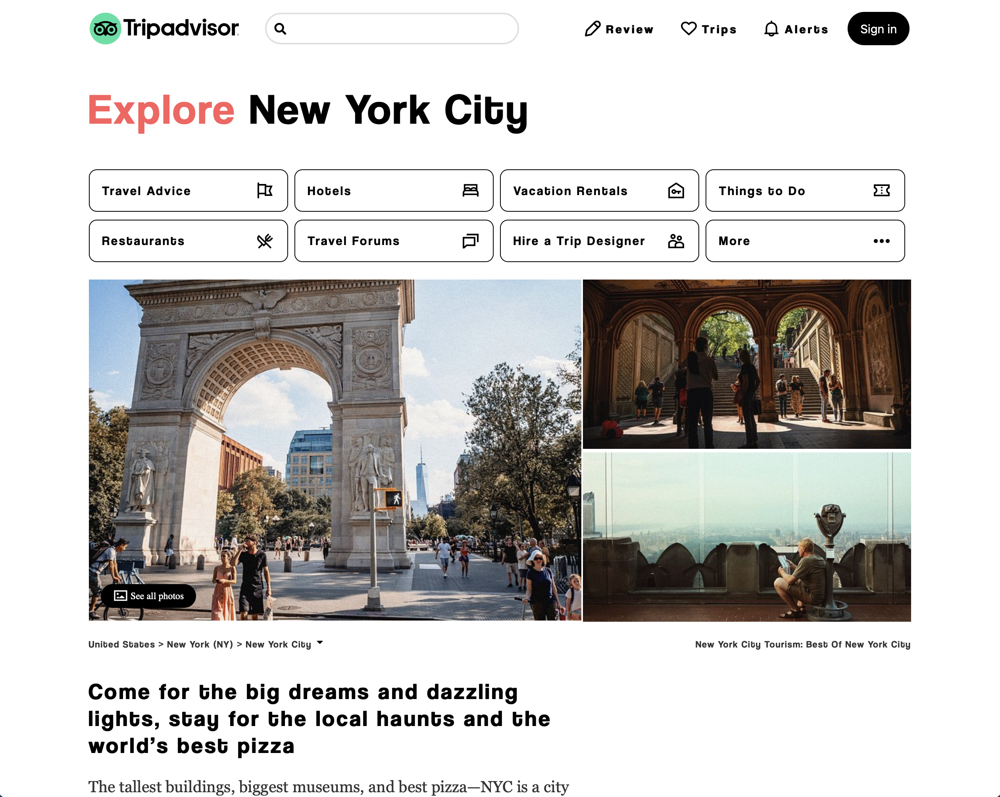

<!-- [![Contributors][contributors-shield]][contributors-url] -->
<!-- [![Stargazers][stars-shield]][stars-url] -->
[![Forks][forks-shield]][forks-url]
[![Issues][issues-shield]][issues-url]
[![MIT License][license-shield]][license-url]
[![LinkedIn][linkedin-shield]][linkedin-url]

<!-- PROJECT LOGO -->
 

  
  

  <h2 align="center">Tripadvisor Clone</h2>

  

    Clone the home page of Tripadvisor with Bootstrap
     
    <!-- <a href="https://github.com/JulesEfrei/Tripadvisor-Clone"><strong>Explore the docs</strong></a> -->
     
     
    <a href="https://julesefrei.github.io/Tripadvisor_Clone/">View Demo</a>
    ·
    <a href="https://github.com/JulesEfrei/Tripadvisor_Clone/issues">Report Bug</a>
    ·
    <a href="https://github.com/JulesEfrei/Tripadvisor_Clone/pulls">Request Feature</a>
  

<!-- TABLE OF CONTENTS -->

  
Table of Contents

  <ol>
    <li>
      <a href="#about-the-project">About The Project</a>
      <ul>
        <li><a href="#built-with">Built With</a></li>
      </ul>
    </li>
    <li><a href="#roadmap">Roadmap / Features</a></li>
    <li><a href="#license">License</a></li>
    <li><a href="#contact">Contact</a></li>
    <li><a href="#credit">Credit</a></li>
  </ol>

<!-- ABOUT THE PROJECT -->
## About The Project

Clone the home page of Tripadvisor with Bootstrap (School Project)

**State of project => v1.0.0**

(<a href="#top">back to top</a>)

### Built With

This section should list any major frameworks/libraries used to bootstrap your project.

* [Bootstrap](https://getbootstrap.com)

(<a href="#top">back to top</a>)

<!-- ROADMAP -->
## Roadmap

Here is the roadmap of the project. Checked flags mean the features is out and unchecked flags mean that the feature is comming.

- [x] Release v.1.0.0

See the [open issues](https://github.com/JulesEfrei/Tripadvisor_Clone/issues) for a full list of proposed features (and known issues).

(<a href="#top">back to top</a>)

<!-- Credit -->
## Credit

List of people

* [Me](https://github.com/JulesEfrei)

(<a href="#top">back to top</a>)

<!-- CONTACT -->
## Contact

Linked'in - [Jules](https://www.linkedin.com/in/jules-bruzeau/)

GitHub Profile: [JulesEfrei](https://github.com/JulesEfrei/)

(<a href="#top">back to top</a>)

<!-- LICENSE -->
## License

Distributed under the MIT License. See `LICENSE.txt` for more information. If no license is available in the repository, it will be available one day, I hope.

(<a href="#top">back to top</a>)

<!-- MARKDOWN LINKS & IMAGES -->
<!-- [contributors-shield]: https://img.shields.io/github/contributors/JulesEfrei/Tripadvisor-Clone.svg?style=for-the-badge
[contributors-url]: https://github.com/JulesEfrei/Tripadvisor-Clone/graphs/contributors -->
<!-- [stars-shield]: https://img.shields.io/github/stars/JulesEfrei/Tripadvisor-Clone.svg?style=for-the-badge
[stars-url]: https://github.com/JulesEfrei/Tripadvisor-Clone/stargazers -->
[forks-shield]: https://img.shields.io/github/forks/JulesEfrei/Tripadvisor_Clone.svg?style=for-the-badge
[forks-url]: https://github.com/JulesEfrei/Tripadvisor_Clone/network/members
[issues-shield]: https://img.shields.io/github/issues/JulesEfrei/Tripadvisor_Clone.svg?style=for-the-badge
[issues-url]: https://github.com/JulesEfrei/Tripadvisor_Clone/issues
[license-shield]: https://img.shields.io/github/license/JulesEfrei/Tripadvisor-Clone.svg?style=for-the-badge
[license-url]: https://github.com/JulesEfrei/Tripadvisor_Clone/blob/master/LICENSE.txt
[linkedin-shield]: https://img.shields.io/badge/-LinkedIn-black.svg?style=for-the-badge&logo=linkedin&colorB=555
[linkedin-url]: https://www.linkedin.com/in/jules-bruzeau/
[product-screenshot]: images/screenshot.png